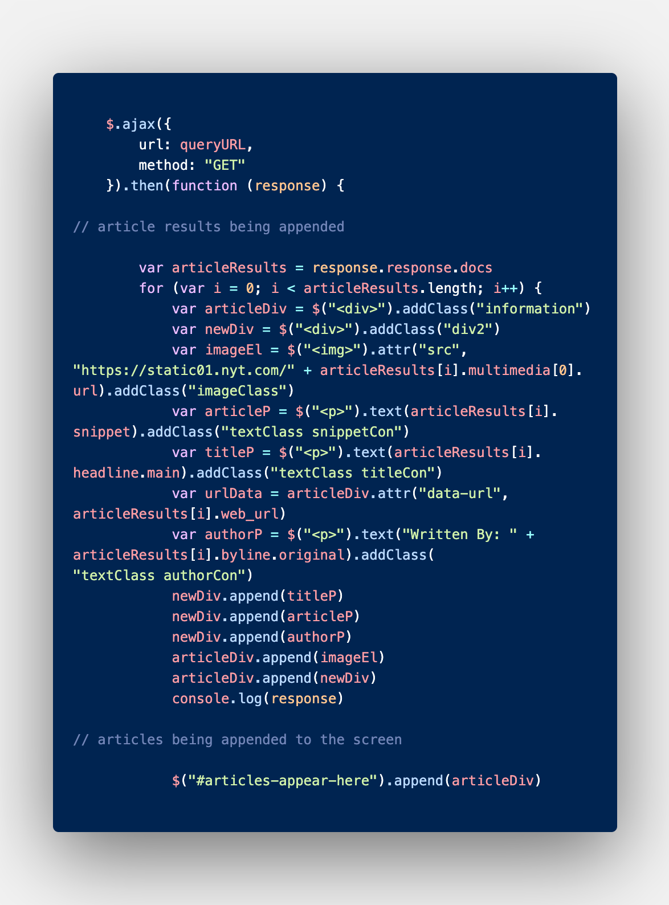
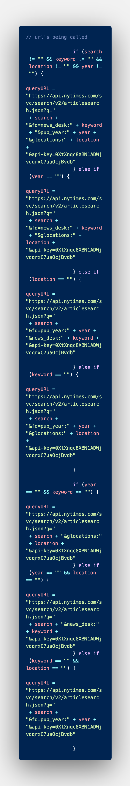

# New York Times Article Search

### This project aims to allow users an accessible way to search for articles published by the New York Times. 

## Languages Used:
* HTML
* CSS
* JQuery
* Ajax

## Additional:
* Bootstrap CSS

## APIs Used:
* New York Times Article Search https://api.nytimes.com/svc/search/v2/articlesearch.json

## Directions:
1. Enter a Topic of Interest
2. Enter *OPTIONAL* paramaters (location, keyword, publication year)
3. Scroll to top 
4. Refresh page for new search. 

## Screenshots:

## Demo: 

